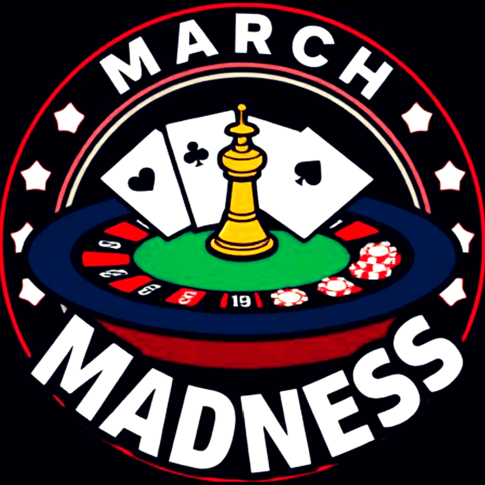

# Name
March Madness Betting Platform

# Description
This project will be able to provide a platform for users to bet money on basketball teams for this year's March Maddness. Specific features are yet to be determined, but it serves the general purpose of provided a sports betting platform. During discussion, it was mentioned that the functionaliy would be similar to how ESPN does betting.

# Instructions
##Docker
How to start containers:
```shell
docker-compose up --build 
```

##React
How to start React server:
```shell
npm run dev
```

## Visuals
Logo for our project:


## Roadmap

# Planning Stage
We are in the progress of deciding what functionality we want out project to have. We have a logo and plan on what tools we want to use to develop the platform.

# Development Stage
We intend developing the backend using python and creating the frontend/UI using react.

## Authors and acknowledgment
Stephen Bail, Norris Chen, Jack Hanfland, Max Hubenko, Krishaan Ghagat, and Lance Munson

# Project status
This project is still in the beginning stages of development. We have yet to come up with any ideas for functionality but we have came up with a logo, a style guide, a SKELETON.md template, a ROLES.md file, and a README.md file.

## Sprint 1, Week 0 (Febuary 12 - 19) - Progress Report
So far, we have completed the Figma design for the UI, and initialized the React application. We have set up the SQL database, and found APIs that could be used for our project. We also researched about the backend to understand the work and code we will need for the future.

Our plan for this week is to set up the backend. And then containerize the frontend, backend, and database, and ensure communication between all three.

## Sprint 1, Week 1 (Febuary 19 - 26) - Progress Report
Nect expected project update on the 26th
